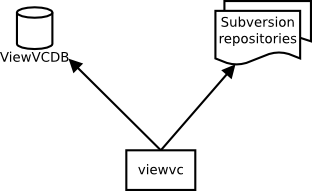

disnix-viewvc-example
=====================
This is an example case that deploys a [ViewVC](http://viewvc.tigris.org)
environment, a web-based CVS and Subversion repository viewer with Disnix.

Architecture
============

The above figure shows the architecture of the ViewVC system. The system consists
of the ViewVC web front-end, a ViewVC MySQL database storing commit records, and
a collection of Subversion repositories. All the components in the figure are
*distributable* components (or *services*) which can deployed on various machines
in the network.

Usage
=====
The `DistributedDeployment/` sub folder contains all neccessary Disnix models,
such as a services, infrastructure and distribution models required for
deployment.

Deployment using Disnix in a heterogeneous network
--------------------------------------------------
For this scenario only installation of the basic Disnix toolset is required.
First, you must manually install a network of machines running the Disnix
service. Then you must adapt the infrastructure model to match to properties of
your network and the distribution model to map the services to the right
machines.

To deploy the databases you must install [MySQL](http://www.mysql.com). To deploy
the web application services you must install the
[Apache HTTP server](http://httpd.apache.org). Check the instructions of your
Linux distribution or the software distributions themselves how to install these
system services. Dysnomia detects the presence of these system services and
configures the activation scripts to use them.

The system can be deployed by running the following command:

    $ disnix-env -s services.nix -i infrastructure.nix -d distribution.nix

Hybrid deployment of NixOS infrastructure and services using DisnixOS
---------------------------------------------------------------------
For this scenario you need to install a network of NixOS machines, running the
Disnix service. This can be done by enabling the following configuration
option in each `/etc/nixos/configuration.nix` file:

    services.disnix.enable = true;

You may also need to adapt the NixOS configurations to which the `network.nix`
model is referring, so that they will match the actual system configurations.

The system including its underlying infrastructure can be deployed by using the
`disnixos-env` command. The following instruction deploys the system including
the underlying infrastructure.

    $ disnixos-env -s services.nix -n network.nix -d distribution.nix

Deployment using the NixOS test driver
--------------------------------------
This system can be deployed without adapting any of the models in
`deployment/DistributedDeployment`. By running the following instruction, the
variant without the proxy can be deployed in a network of virtual machines:

    $ disnixos-vm-env -s services.nix -n network.nix -d distribution.nix

Deployment using NixOps for infrastructure and Disnix for service deployment
----------------------------------------------------------------------------
It's also possible to use NixOps for deploying the infrastructure (machines) and
let Disnix do the deployment of the services to these machines.

A virtualbox network can be deployed as follows:

    $ nixops create ./network.nix ./network-virtualbox.nix -d vboxtest
    $ nixops deploy -d vboxtest

The services can be deployed by running the following commands:

    $ export NIXOPS_DEPLOYMENT=vboxtest
    $ disnixos-env -s services.nix -n network.nix -d distribution.nix --use-nixops

Running the system
==================
After the system has been deployed, open a web browser and type the following URL:

    http://test1/viewvc/bin/cgi/viewvc.cgi

The `test1` hostname must be replaced by the real hostname of the machine to
which the web application front-end is deployed. Check the distribution model for
this. If the network expression is used included in this example, the third
machine in the network machine automatically boots into IceWM and includes the
Mozilla Firefox web browser for convenience.

License
=======
This package is released under the [MIT license](http://opensource.org/licenses/MIT).
The Subversion repositories are each covered by their own license.
